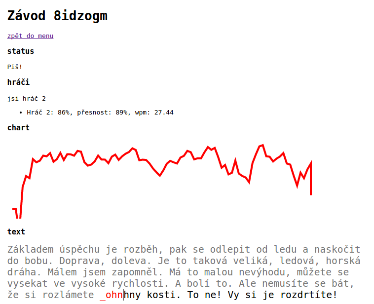

# Teplý datel

Rychlopsaní s teplým datlem je webová hra, ve které se soutěží v rychlopsaní na
českých úryvcích textu nebo filmových hláškách.

url: [http://teplydatel.cz](http://teplydatel.cz)

## Instrukce
Hra má 3 herní módy:
* **veřejný závod**: soutěž s kýmkoliv, kdo také spustí veřejný závod
* **soukromý závod**: vytvoří závod, jehož url lze zkopírovat a poslat dalším hráčům
* **trénink**: nečeká se na příchozí hráče, hra pro jednoho hráče

## Poznámky
Projekt vzniknul jako ve volné chvíli během pár víkendů a další vývoj
momentálně není v plánu.  Nejsou podporovány starší prohlížeče především kvůli
použítí websocketů.

* server v [Go](https://golang.org/)
* klient v [Typescriptu](http://www.typescriptlang.org/) a Javascriptu + [jQuery](https://jquery.com/) + [d3.js](http://d3js.org/)

## Ukázka

  

